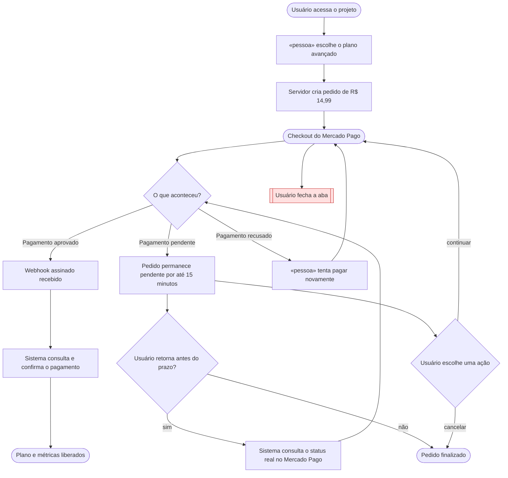

# Jornadas de Usuário

**Projeto:** Gerenciador de Projetos e Atividades
**Versão:** 1.0.0
**Última atualização:** 2026-09-20

> Este documento descreve o caminho que a pessoa percorre na tela e os pontos
> onde ela trava, espera ou desiste. Regras de negócio permanecem no `prd.md`;
> estados, entidades e contratos pertencem ao `architecture.md`.

## Jornada 1 — Compra do plano avançado

**Story:** US07
**Critérios que ela marca:** sai do site e volta; depende do tempo; depende de outra pessoa agir; pode ser abandonada.

**O que decidimos sobre o nó vermelho:**

Se o usuário fechar a aba ou abandonar o checkout, o pedido permanecerá pendente
por até 15 minutos. Durante esse período, ele poderá consultar o status real no
Mercado Pago, continuar o pagamento ou cancelar o pedido. Se não houver conclusão
nesse prazo, o pedido será finalizado sem liberar o plano. Um pagamento só será
considerado aprovado após a confirmação por webhook assinado do Mercado Pago.

## Dúvidas em aberto

| # | Dúvida | Onde ela precisa ser resolvida |
| --- | --- | --- |
